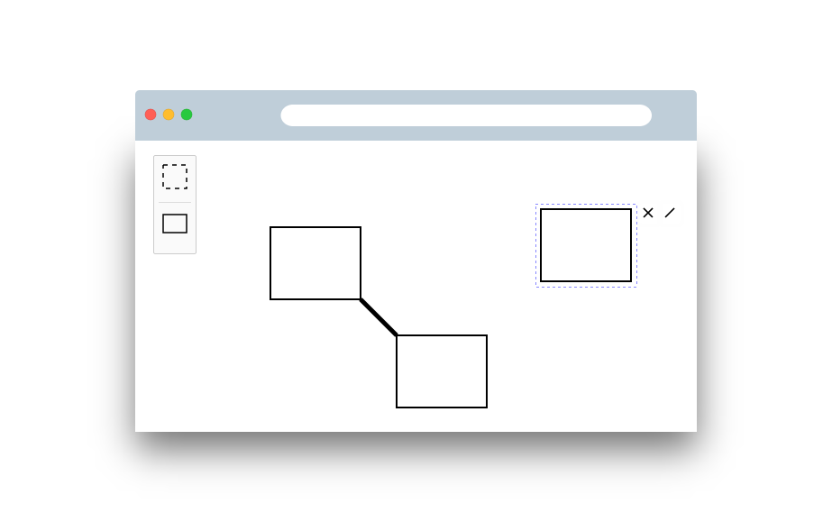

# diagram-js Example App



An example application build with diagram-js. You can use this as a starting point for building your project.


## Building the Project

Initialize the project dependencies via

```
npm install
```

To create the sample distribution in the `dist` folder run

```
npm run all
```

To bootstrap a development setup that spawns a small webserver and rebuilds your app on changes run

```
npm run dev
```


## Licence

MIT